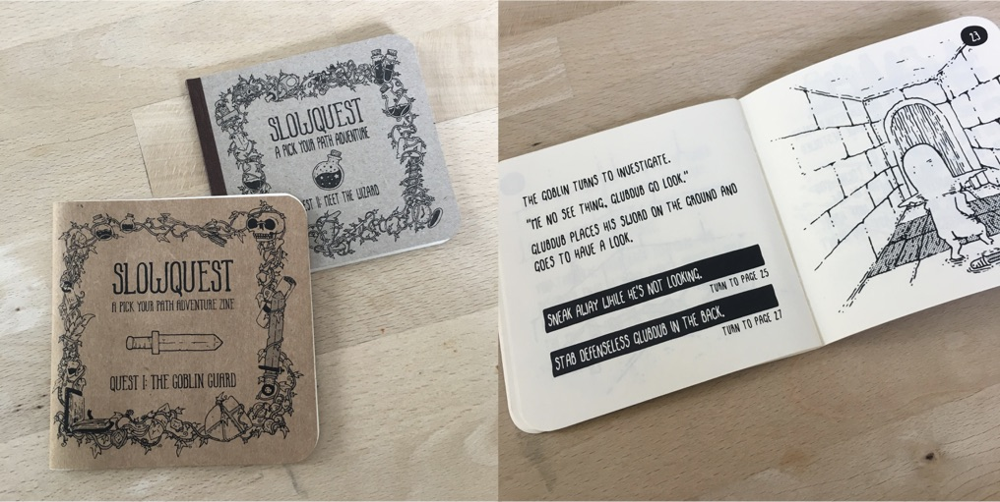
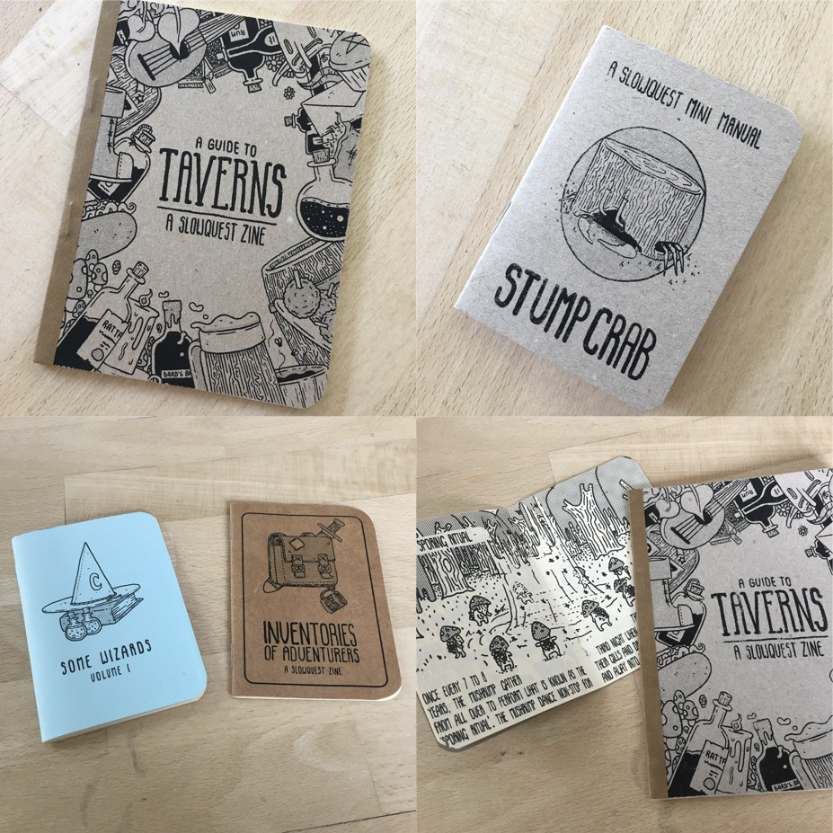
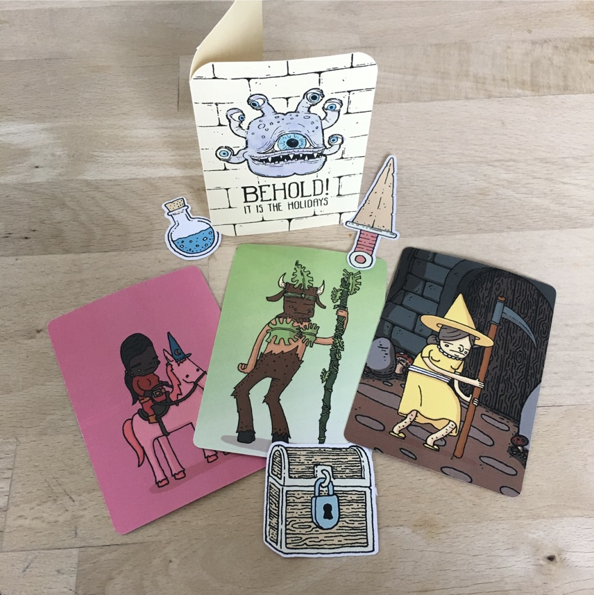
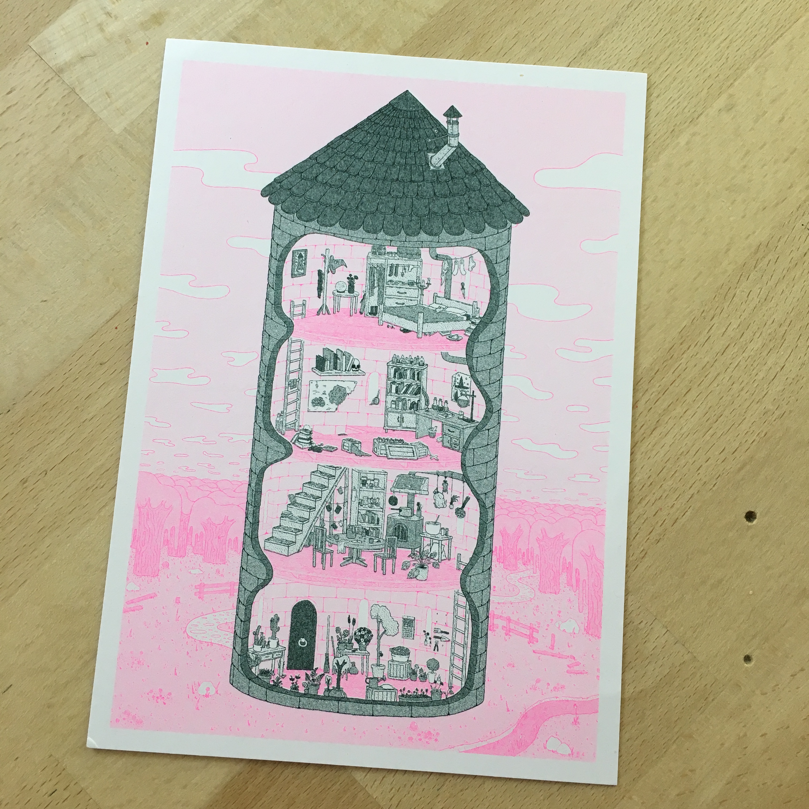
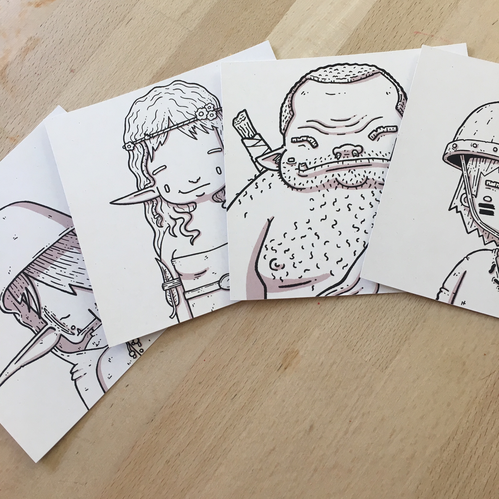

Art - I'm far from an aesthete, I couldn't tell you what colour puce is without having to look it up for the 100th time and  to be honest I didn't even know what "aesthete" meant until I looked that up. I also couldn't tell you why that picture of a lemon floating on a sea of magnets was a scathing indictment on the 1990's political climate in Manila - and to be entirely honest I can't even tell you if that’s a real work of art or something I just made up - it's been a long day.

But despite my failings as a connoisseur of the arts I can absolutely without a doubt tell you when I like a bit of art - and that, dear readers, is exactly what I'm about to do right now.... brace yourselves.

[Bodie Hartley](https://www.instagram.com/bodieh/) is a fantasy illustrator that creates art prints to collectors cards to little choose your own adventure books. Not only is his [Instagram](https://www.instagram.com/bodieh/)  a treasure trove of amazing art but he also sells this work via his online shop - [Slowquest](http://slowquest.bigcartel.com/).

I've been collecting various bits and pieces he's been creating for the past year or two, but it's much better if I show you instead of telling you.

## Choose Your Own Adve..., ahem, Pick Your Path

The first thing that ever drew me into his work was the Pick Your Path zine that he had released.  It's a tiny little book but still a fully complete little adventure.  Sure, the adventure itself isn't exactly going to rock your world but that’s not the point.  The complete package is just a brilliant little bit of interactive art that you can hold in your hand, flick through pages and generally admire the awesome loveliness of it all.

## Other Zines

Other books/zines he has created are little informational books.  These can be used as a source of inspiration for dungeon masters wanting to build up a bit of lore around the world they create while role playing.  Or, you know, just look at because they're great - a little bit of quirkiness, a little bit of humour and lovely monochromatic art and writing.

## Collectors Cards, Stickers and Other Things

Aside from the books and zines Bodie has created there have been a slew of other little bits and pieces along the way.

The cards which feature things like traits, characters, weapons and spells were created so they could be used to do things like generating NPC in a D&D session but as with the books just collecting these and leafing through is a lovely experience.

Over the holidays last year he even included a Beholder greetings card with every order - something that I think I was supposed to be given away to someone but there was no way in hell I was doing that.

## Artwork and Commissions

Bodie has also dabbled in art that can be hung on a wall and admired.  There are a few stock pieces available and recently(ish) he has started toying with watercolours to add some colours to his work.

Early last year I mailed Bodie to see if he was available to do a commission piece as I wanted something particular I could put on my wall but unfortunately at that time he was working full time and didn't have the capacity to take commissioned work.  Fast forward to early this year and it turned out he was pursuing this art full time and now taking commissions. 

Awwww yeah.  I wanted to get a small commissioned piece for each member of the family and boy did he deliver.

These bad boys are going up, pride of place, in the games corner of our house.
