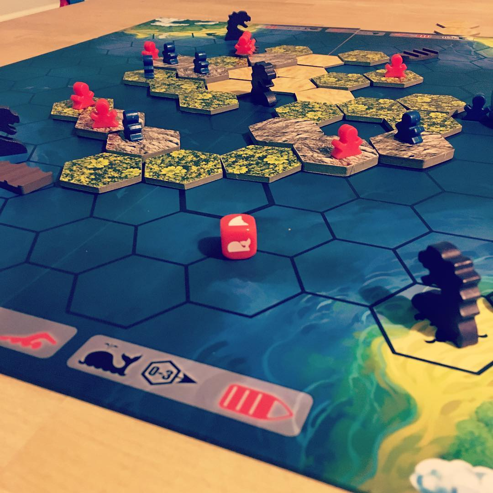

[Survive: Escape from Atlantis](https://boardgamegeek.com/boardgame/2653/survive-escape-atlantis) is like playing [Forbidden Island](https://boardgamegeek.com/boardgame/65244/forbidden-island) except you discover you're playing [Carcassonne](https://boardgamegeek.com/boardgame/822/carcassonne) but you're playing it in reverse for some reason and someone decided to throw their copy of Get Bit into the mix.

[Survive: Escape from Atlantis](https://boardgamegeek.com/boardgame/2653/survive-escape-atlantis) is nearly as old as me.

Survive: Escape from *Atlanta* is a not a Walking Dead themed version of this game but it wouldn't surprise me if it eventually became one - you know what these crazy brands are like.

[Survive: Escape from Atlantis](https://boardgamegeek.com/boardgame/2653/survive-escape-atlantis) sees players try and get their meeples off a sinking island, Atlantis, with various amounts of loot (each meeple has a certain score 1-6 that is undisclosed once the game starts) by boat or swimming.  The winner is the one with the most loot at the end, so the more meeples you get on one of the four islands the better chance you have of winning.

Players take turns to

1. move their people
2. sink a part of the island, and,
3. moving the "dangers" around the board

Movement is fairly straight forward; you can move your people or boats you control via 3 moves.  There are some special rules for swimmers but that’s roughly it.

Sinking the island is a matter of removing a tile, the sand tiles need to go first, then forest then mountain.  If you're feeling cheeky you can sink a tile that has another player’s meeple on it forcing them into the water.  The tile you pick also has an action on the back, sometimes it's immediate (put a shark or whale in the spot), sometimes it allows you to collect cards to either prevent disaster later on or make extra moves.  Once a person takes the mountain tile revealing the volcano the whole island and everyone in the see is swallowed up and the game ends.

At the end of your move you get to roll a dice and move the various dangers around the board.  There are whales, that will capsize boats and throw everyone in the drink.  Sharks gobble up swimmers and, finally; sea monsters, aka the assholes of the sea, capsize boats and eat all swimmers on the tile.  This means you get to set the various dangers on a collision course with the other players.

So, that's the rough overview but how does it play?  Well, pretty slick.  The simple rule set means that play tends to flow nicely and the distribution of events (like adding new dangers) ramps up nicely so one minute you're thinking "ok I think I have a plan to get my people off the island" suddenly becomes "oh, where did all the sharks come from?!".  There is no reading involved or complex rules and even my youngest who can't read yet is able to play on his own rather than as part of a team.  There is enough hidden knowledge that allows you to play somewhat strategically rather than just rely on luck and chance but it's not required, the little ones won't get frustrated that you are trouncing them because they can't recall all the points their people have, but also, they can feel pretty good about themselves that they managed to ferry their high value meeples off the island while you wasted your time making a shark chase one of their 1-point meeples for 2 rounds.

The component quality is great.  We got the 30th anniversary edition, the board is a nice matt printing, the meeples are basic plastic but solid enough, the boats, shark, whales and sea monsters are plain wood and the tiles are nice hefty cardboard.

If I had to level any sort of criticism against it I'd say that there is a still a fairly large element of luck involved. Getting a bad run of tiles can really leave you with a lot of dead meeples and it can be rather frustrating.  That said this is offset slightly by the fact no one really knows how far ahead or behind they are because of the different point values for each meeple.  Unless there is a massive discrepancy between the number of meeples saved per player it's still anyone’s game and the suspense adds to the fun.  Is there a chance it could get repetitive?  Perhaps but I haven't really played it enough to say for sure.

All in all, everyone at D!B!D! would recommend this game and we will certainly be playing more of it in the future.

