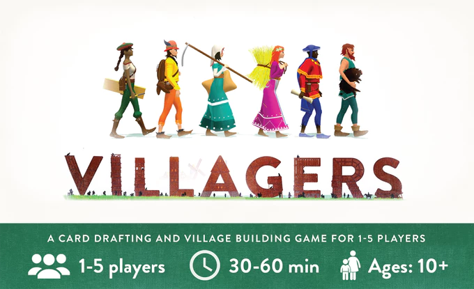

[Villagers](https://boardgamegeek.com/boardgame/241724/villagers), a euro card drafting game, has entered its final hours of its hugely successful [Kickstarter](https://www.kickstarter.com/projects/sinisterfish/villagers-card-drafting-and-village-building-for-1?ref=discovery) campaign and so far is just over 5000% funded - yep that is not a typo **five thousand** percent.  So it seems I'm not the only person excited for this one.

The goal in [Villagers](https://boardgamegeek.com/boardgame/241724/villagers) is to rebuild your village after the Black Death has taken the lives of many people.  The player who has the most prosperous village by the end is the winner.  Revenue is generated by drafting cards to produce production lines so a lumberjack might feed into a wheeler (the wood to produce wheels) which then feeds into a cartwright (to build carts) which will generate a revenue when sold at the market.  

[Villagers](https://boardgamegeek.com/boardgame/241724/villagers) has a current estimated delivery time of early next year so if you're looking for something to warm those cold February nights, have anywhere between 0 to 4 friends and like a bit of Euro card drafting I recommend you get backing this project before the day is out.

[Kickstarter: Villagers - Card drafting & village building for 1-5 players](https://www.kickstarter.com/projects/sinisterfish/villagers-card-drafting-and-village-building-for-1?ref=discovery)